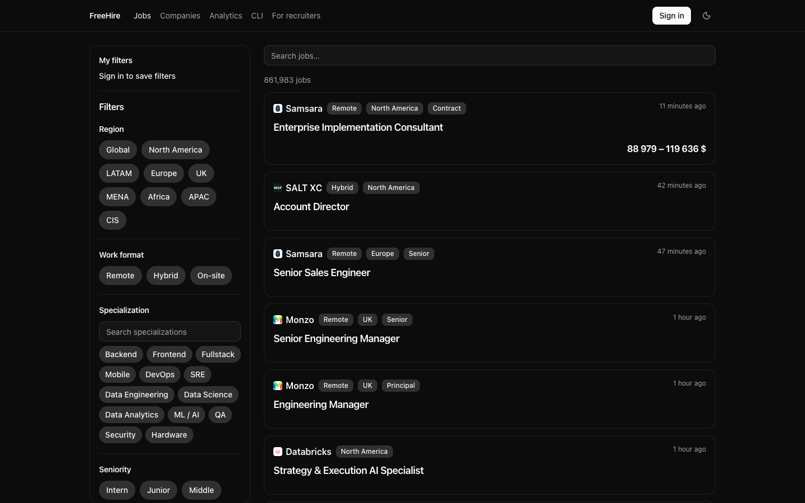

<div align="center">

# freehire

### Every IT job, straight from the source.

**1.1M+ live postings pulled directly from company career pages — no recruiters, no reposts, no dead links. Fully open source.**

[**Try it live →**](https://freehire.dev) · [Sources](#sources) · [API](#api) · [Add a source](#adding-a-source) · [Contributing](CONTRIBUTING.md)

[](https://freehire.dev)
[](LICENSE)


[](https://github.com/strelov1/freehire/stargazers)

<br>



</div>

## Why freehire?

- **Straight from the source.** Every listing is crawled directly from a company's
  own ATS — Workday, Greenhouse, Lever, Ashby, iCIMS and a long tail of others — and
  links to the original posting. No recruiter reposts, no aggregator middlemen, no
  dead links.
- **One schema, deduplicated.** The same role posted to three boards collapses into
  one entry: every posting is normalized into a single shape and deduplicated on a
  stable key.
- **Search that understands jobs.** Faceted full-text search over region, work mode,
  seniority, skills and salary — derived from curated dictionaries, never guessed.
- **Actually open.** MIT-licensed and self-hostable, pipeline and data both in the
  open. Adding a company is one line of YAML.
- **Yours to build on.** A clean HTTP API, a CLI, Telegram digests, and per-user
  application tracking — use the hosted site, run your own, or build on top.

Aggregating **1.1M+ live postings** from **29,000+ companies** across **50+
sources** — see [Sources](#sources) for the full breakdown.

## Stack

- **Go** + [Fiber v2](https://gofiber.io/) — HTTP server
- **PostgreSQL** — storage and filtering
- **[sqlc](https://sqlc.dev/)** — type-safe DB access from SQL (no ORM)
- **[Meilisearch](https://www.meilisearch.com/)** — full-text and faceted job search
- **[langchaingo](https://github.com/tmc/langchaingo)** — LLM access over any OpenAI-compatible endpoint (no vendor baked in)
- **Docker Compose** — local development

## Quick start

```bash
make up        # build + start app, postgres, and meilisearch in Docker
curl localhost:8080/health
curl localhost:8080/api/v1/jobs
```

Migrations are applied automatically on first Postgres volume init
(the `migrations/` folder is mounted into `/docker-entrypoint-initdb.d`).
Changing a migration does not re-apply to an existing volume — recreate it with
`docker compose down -v && make up`, or apply pending files manually with
`make migrate`.

If port 8080 is already taken, pick another host port:

```bash
HIRE_HOST_PORT=8090 make up
```

## Local development

```bash
docker compose up -d db   # database only
make run                  # server on host, reads DATABASE_URL
```

Copy `.env.example` to `.env` and adjust as needed. `JWT_SECRET` is required for
the server to start; OAuth and LLM credentials are optional (the features they
gate stay disabled when unset).

## Commands

```bash
make help      # list all commands
make sqlc      # regenerate code from SQL (via Docker, no local sqlc needed)
make tidy      # go mod tidy
make psql      # psql inside the DB container
make reindex   # rebuild the Meilisearch index from Postgres
make migrate   # apply migrations manually to an existing DB volume
```

## Workers

The server only serves the API. Ingest and enrichment are standalone, run-once
workers meant for cron — each crawls or drains its queue and exits.

```bash
go run ./cmd/ingest sources/greenhouse.yml  # crawl one board file and upsert jobs (path also via SOURCES_FILE)
go run ./cmd/enrich        # drain the enrichment queue (LLM); needs LLM_* config
go run ./cmd/tg-ingest     # crawl the Telegram channels in sources/telegram.yml
go run ./cmd/tg-extract    # LLM-extract vacancies from crawled Telegram posts
go run ./cmd/reindex       # rebuild the Meilisearch index from Postgres
go run ./cmd/backfill-derive  # re-derive all six dictionary facets on existing jobs (follow with make reindex)
```

## Layout

```
cmd/                 entry points: server + the standalone workers above
sources/             board files, one per provider (e.g. greenhouse.yml = company + board id),
                     plus a mixed custom.yml and telegram.yml (Telegram channels to crawl)
internal/
  config/            env configuration
  database/          pgxpool connection pool
  db/                generated sqlc code + queries/*.sql
  handler/           HTTP handlers
  auth/              auth primitives (JWT cookie, API keys) + OAuth sign-in
  sources/           ATS source adapters (greenhouse / lever / ashby) + registry
  linksource/        resolves outbound job links found in Telegram posts
  telegram/          Telegram-channel crawl + LLM vacancy extraction
  pipeline/          ingest runner (fetch → normalize → dedup → upsert)
  enrich/            typed AI-enrichment contract + queue-draining runner
  search/            Meilisearch indexing and query
  location/          geography parsed from free-text ATS location strings
  jobview/           the single public wire shape of a job
  normalize/         slug normalization
migrations/          SQL schema (source for both sqlc and initdb)
```

## API

All responses use `{"data": ...}` (single), `{"data": ..., "meta": {...}}`
(lists), or `{"error": msg}`. Jobs and companies are addressed by their public
slug.

| Method | Path                              | Auth | Description                              |
|--------|-----------------------------------|------|------------------------------------------|
| GET    | `/health`                         | —    | Service and DB status                    |
| GET    | `/api/v1/jobs`                    | —    | List jobs (`limit`/`offset`)             |
| GET    | `/api/v1/jobs/search`             | —    | Full-text + faceted search               |
| GET    | `/api/v1/jobs/:slug`              | —    | Job by slug                              |
| GET    | `/api/v1/companies`               | —    | List companies                           |
| GET    | `/api/v1/companies/:slug`         | —    | Company by slug                          |
| POST   | `/api/v1/jobs/:slug/view`         | ✓    | Record a view                            |
| POST   | `/api/v1/jobs/:slug/apply`        | ✓    | Mark applied                             |
| POST   | `/api/v1/jobs/:slug/save`         | ✓    | Save (bookmark)                          |
| DELETE | `/api/v1/jobs/:slug/save`         | ✓    | Unsave                                   |
| PATCH  | `/api/v1/jobs/:slug/track`        | ✓    | Set application stage / notes            |
| GET    | `/api/v1/me/jobs`                 | ✓    | The caller's tracked/saved jobs          |
| POST   | `/api/v1/me/api-keys`             | 🍪   | Create an API key (returns it once)      |
| GET    | `/api/v1/me/api-keys`             | 🍪   | List API keys                            |
| DELETE | `/api/v1/me/api-keys/:id`         | 🍪   | Revoke an API key                        |
| POST   | `/api/v1/auth/register`           | —    | Register                                 |
| POST   | `/api/v1/auth/login`              | —    | Log in                                   |
| POST   | `/api/v1/auth/logout`             | —    | Log out                                  |
| GET    | `/api/v1/auth/me`                 | ✓    | The current user                         |
| GET    | `/api/v1/auth/oauth/providers`    | —    | Enabled OAuth providers                  |
| GET    | `/api/v1/auth/oauth/:p/start`     | —    | Begin OAuth sign-in                      |
| GET    | `/api/v1/auth/oauth/:p/callback`  | —    | OAuth callback (sets the session cookie) |

Auth legend: **✓** session cookie or API key · **🍪** session cookie only.

## Sources

Live catalogue snapshot — **53 sources**, **29,202 companies**, **1,130,933 open
postings** (1,154,614 total). Counts are open postings unless noted.

| Source | Companies | Open jobs |
| --- | ---: | ---: |
| workday | 3,455 | 377,692 |
| greenhouse | 4,912 | 168,663 |
| icims | 3,610 | 158,684 |
| smartrecruiters | 467 | 81,688 |
| gupy | 1,429 | 77,454 |
| lever | 1,757 | 55,538 |
| bamboohr | 6,593 | 46,914 |
| jibe | 11 | 44,240 |
| ashby | 2,399 | 41,742 |
| oracle | 173 | 14,864 |
| amazon | 1 | 10,643 |
| workable | 287 | 10,056 |
| phenom | 1 | 8,208 |
| arc | 2,912 | 4,719 |
| sber | 12 | 3,757 |
| google | 7 | 3,640 |
| jobstash | 484 | 3,058 |
| mts | 12 | 2,601 |
| alfabank | 1 | 2,389 |
| workatastartup | 189 | 1,916 |
| recruitee | 78 | 1,888 |
| telegram | 845 | 1,564 |
| breezy | 28 | 1,219 |
| wantapply | 362 | 1,048 |
| tbank | 1 | 955 |
| remoteok | 593 | 911 |
| yandex | 1 | 891 |
| uber | 1 | 722 |
| gem | 33 | 518 |
| personio | 21 | 473 |
| rwb | 1 | 430 |
| teamtailor | 27 | 329 |
| linkedin | 216 | 282 |
| successfactors | 1 | 269 |
| vk | 1 | 264 |
| lamoda | 1 | 126 |
| huntflow | 14 | 116 |
| pinpoint | 8 | 97 |
| globalpayments | 1 | 54 |
| tecla | 29 | 54 |
| rippling | 4 | 42 |
| habr_career | 30 | 37 |
| aviasales | 1 | 35 |
| ashbygraphql | 2 | 30 |
| domclick | 1 | 25 |
| ozon | 1 | 23 |
| dodo | 3 | 19 |
| lumenalta | 1 | 16 |
| mtslink | 1 | 8 |
| join | 3 | 7 |
| geekjob | 3 | 4 |
| kuper | 1 | 2 |
| manual | 1 | 1 |

## Adding a source

Adding a company is one entry in the provider's board file (`sources/<provider>.yml`,
or the mixed `sources/custom.yml`) — `company` + `board` (and `provider` when an
entry overrides the file's). Adding an ATS platform is a new adapter in
`internal/sources` plus one line in `sources.All` — every adapter speaks the same
`Source` interface, and `cmd/ingest` validates the file against the registry before
any crawl.

For most companies the platform is already supported, so adding them is just one
line in the board file. Only when a company runs on an ATS we don't cover yet does
it need a new provider (a new adapter). Either way, if you want a source added,
**start by [opening an issue](https://github.com/strelov1/freehire/issues)** — name
the company and its careers URL, and we'll confirm whether it's a one-line add or a
new provider before any code.

## Frontend

A Svelte SPA lives under `web/` and consumes the API (same-origin; a dev Vite
proxy forwards `/api` to the backend).

## Contributing

freehire's core is a small pipeline; the extension point is the **source**
(one entry in a `sources/` board file, or a new adapter in `internal/sources`). New
contributors: open an issue first — issues and PRs from unapproved accounts are
auto-closed by default. See [CONTRIBUTING.md](CONTRIBUTING.md) for the workflow
and [AGENT.md](AGENT.md) for the architecture and conventions. Questions and
ideas go in [Discussions](https://github.com/strelov1/freehire/discussions).

## Security

Found a vulnerability? Report it privately — see [SECURITY.md](SECURITY.md). Do
not open a public issue for security-sensitive reports.

## License

[MIT](LICENSE)
